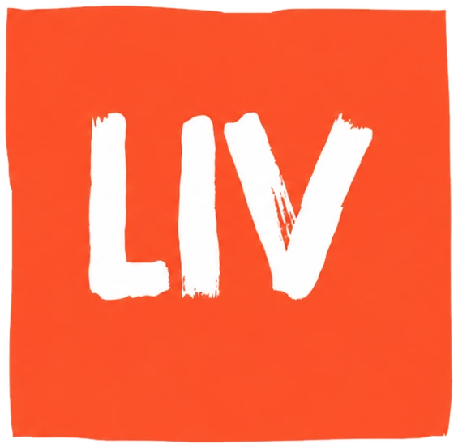
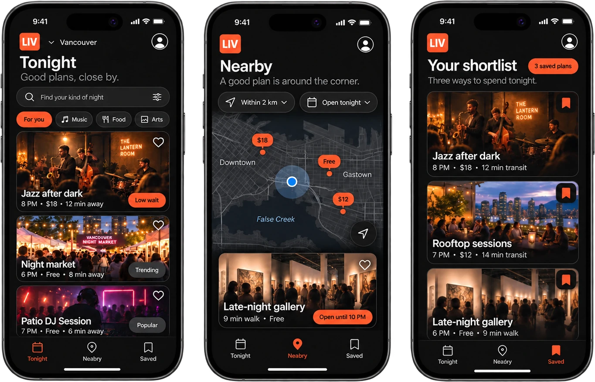
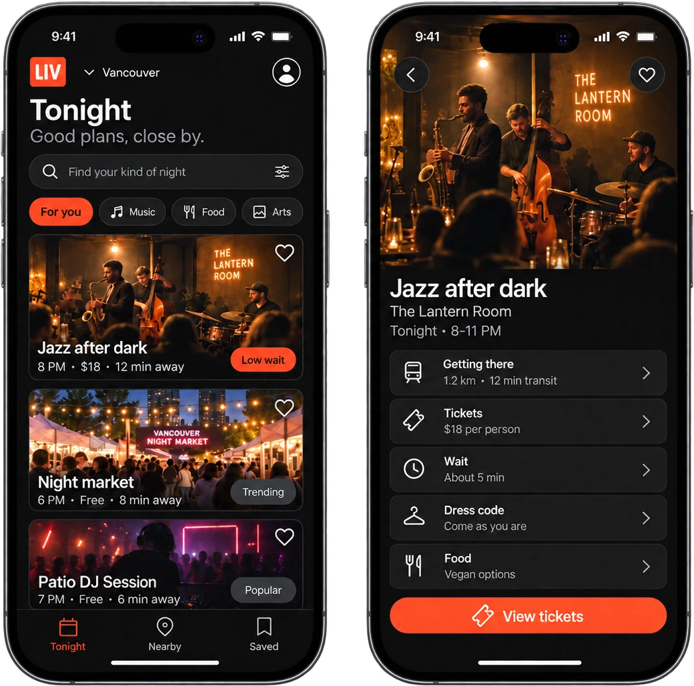
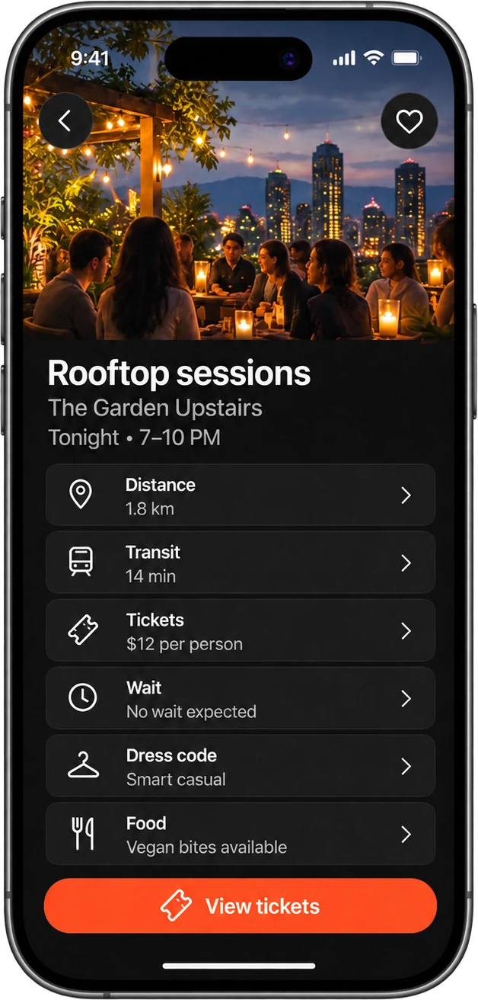
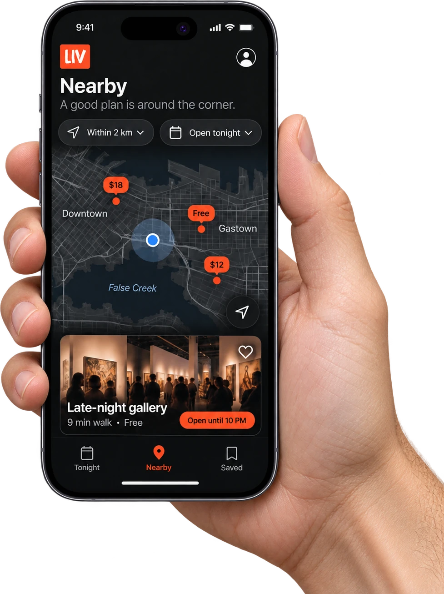
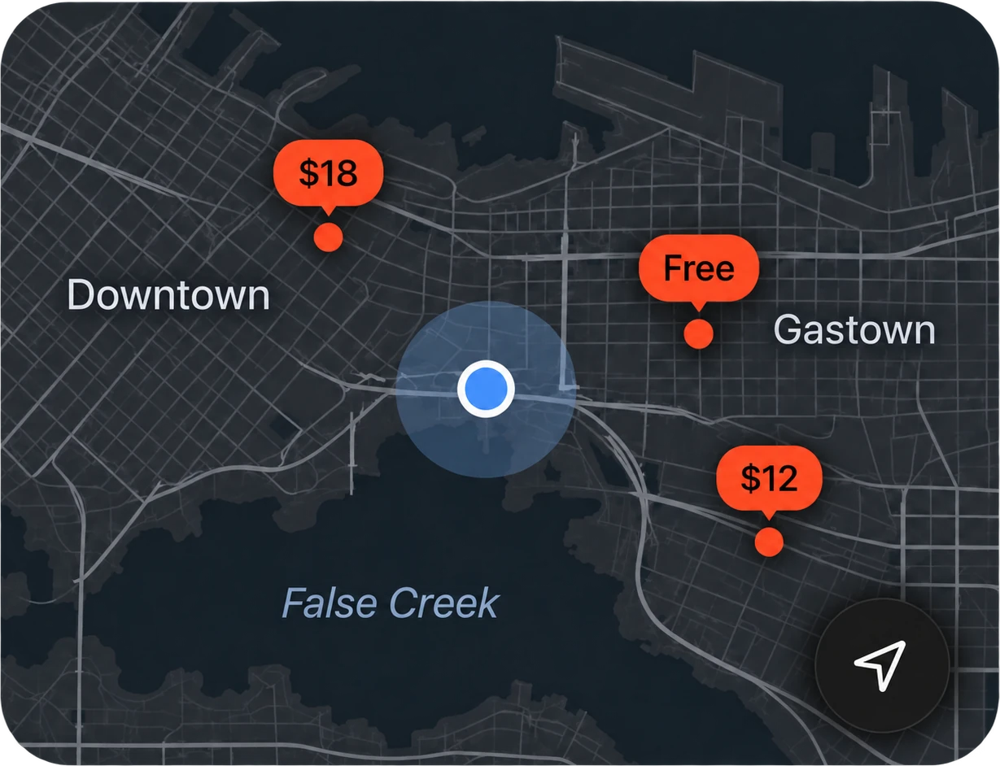
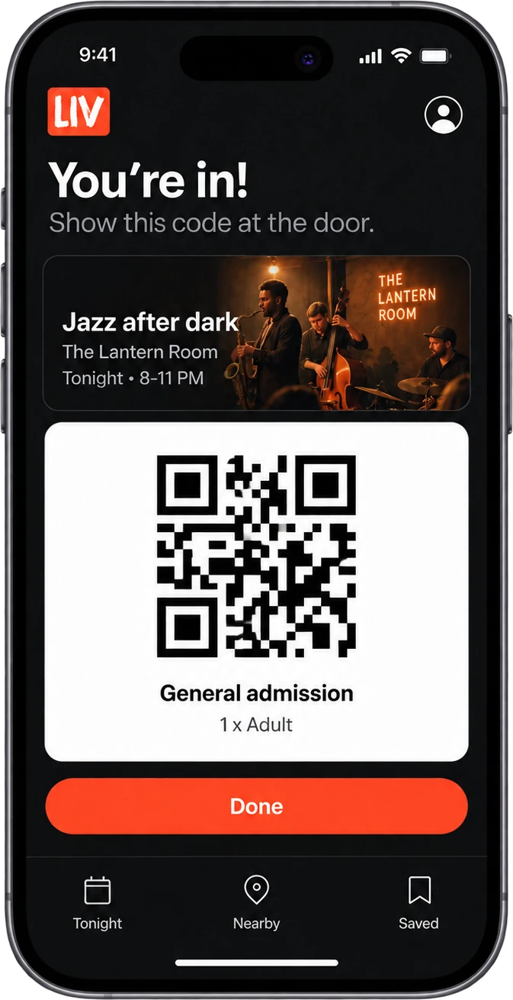

# Liv

**Event discovery for Vancouver, built to move people from “What should we do?” to “Let’s do this.”**

Liv is a product concept, a working prototype and a small user-research project by [Michael Dashti](https://mdashti.vercel.app). This repository holds the prototype code and the full case study.

- **Case study:** [Liv on mdashti.vercel.app](https://mdashti.vercel.app/#/projects) (visual) · [the written case study](docs/Liv_Canonical_PM_Case_Study.md) (full detail)
- **My role:** product concept, product decisions, prototype direction, discovery research, synthesis and concept testing. The prototype was built with AI-assisted development in Replit.
- **Status:** a working prototype and a documented research trail. It has not launched, and no revenue or validated demand is claimed.



---

## The problem

Deciding what to do on a given night means checking several places: social feeds, forums, ticketing sites. I wanted to understand where that process breaks down.

Research showed that every night out starts with six questions, and each one sends people to a different app:

| Question | What people are asking | Where they go today |
| --- | --- | --- |
| **Discovery** | What exists? | Instagram, TikTok, event platforms, Reddit |
| **Trust** | Is it genuinely good or local? | Reddit threads, tagged photos, trusted people |
| **Fit** | Is it right for me? | Taste, atmosphere, food, social context |
| **Feasibility** | Can I realistically go? | Time, distance, price, hours, availability |
| **Timing** | Is it viable right now? | Wait time, current operations, ticket availability |
| **Consensus** | Will my friends agree? | Group chats, shares, direct messages |

## What the research found

| | |
| --- | --- |
| **12** | survey respondents (8 locals, 4 visitors) |
| **8 of 12** | checked more than one source before deciding |
| **3** | concept screens tested: Tonight, Nearby and Saved, Event detail |

1. Discovery is fragmented, but the fragmentation is functional.
2. Trust depends on context, not just star ratings.
3. Group coordination is already part of the decision.
4. Local supply, not demand, is the real product risk.

These findings led to a single decision surface that combines availability, distance, price and trust signals.

<sub>A convenience sample of 12 Vancouver-area respondents. Directional signal from structured interviews and concept testing, not a statistically representative study.</sub>

## The screens



**One feed, one decision screen.** Eight of the twelve people surveyed checked more than one source before deciding. This is what those tabs become: what is on tonight, and what it takes to go.

<table>
  <tr>
    <td width="50%"></td>
    <td width="50%"></td>
  </tr>
  <tr>
    <td><b>All your questions answered, in one place.</b> Distance, transit, tickets, wait, dress code and food on one screen.</td>
    <td><b>What’s nearby?</b> What’s open tonight, how far it is, and what it costs, without leaving the sidewalk.</td>
  </tr>
  <tr>
    <td></td>
    <td></td>
  </tr>
  <tr>
    <td><b>Map discovery.</b> Every option on one map, priced at a glance.</td>
    <td><b>QR at the door.</b> Each offer gets its own code to show at the venue.</td>
  </tr>
</table>

## What’s in the build

**Working** runs in this prototype. **Partly working** runs in the prototype with pieces missing. **Concept** exists only as designed screens.

| Feature | Status | Detail |
| --- | --- | --- |
| Tonight feed with recommendations | Working | The feed ranks listings through a rule-based scoring API that weighs category preference, price range, tags, interaction history, ratings and recency. Not machine learning. |
| Search and category filtering | Working | Search across listings, and filter by music, food and local offers. |
| Nearby map | Working | Leaflet map with a marker and popup per venue, and a list sorted by distance from your location. |
| Event detail | Working | Price, place and timing for each listing, with its deal or ticket. |
| QR deal codes | Partly working | Each deal opens a screen with its code and a countdown. Nothing validates or redeems the code at the venue, and there is no point-of-sale integration. |
| Saved shortlist | Partly working | Save and remove places during a session. The list isn’t stored yet. |
| Learning from behaviour | Partly working | The server records interactions and preferences and feeds them into the score, but the current client doesn’t send those events yet. |
| Profile and preferences | Concept | The screen is designed; the preferences API exists on the server but isn’t connected to it. |
| Wait times, ticketing, sharing | Concept | Shown in the mockups above; proposed as the next priorities below. |

Listings are seeded sample data built around real Vancouver venue names (see [`Liv/server/seed.ts`](Liv/server/seed.ts)). They are not live feeds.

## What I’d build next

| Priority | Goal | What it includes |
| --- | --- | --- |
| **P0** | Reduce decision friction | Personalized feed, explainable rationale, time/distance/price/availability context, one-tap sharing |
| **P1** | Increase confidence | Real-time wait time and ticket availability, recent photos and venue verification, nearby backup options |
| **P2** | Enable transactions | Ticketing and reservation deep links, embedded transaction flows where justified |

The next tests, in order: **supply reliability** (enough current local inventory in one neighbourhood?), **decision value** (does context reduce time-to-choice?), **personalization** (do people see why something was shown?), **group decisions** (does sharing help groups converge?) and **repeat value** (do people come back?). The reasoning behind each is in the [case study](docs/Liv_Canonical_PM_Case_Study.md#11-next-experiments-reduce-uncertainty-in-sequence).

---

## Running the prototype

The app lives in [`Liv/`](Liv): a React + TypeScript client (Vite, Tailwind, TanStack Query, Wouter, Leaflet) and an Express API on PostgreSQL through Drizzle ORM.

You need Node.js 18+ and a PostgreSQL connection string.

```bash
git clone https://github.com/texacouver/liv-app.git
cd liv-app/Liv
npm install
export DATABASE_URL="postgres://…"   # your PostgreSQL connection string
npm run db:push                      # create the tables
npm run dev                          # http://localhost:5000
```

Then load the sample venues once:

```bash
curl -X POST http://localhost:5000/api/seed
```

## Repository map

```
docs/
  Liv_Canonical_PM_Case_Study.md   the full case study: problem, research, V2 tests, priorities, metrics
  assets/                          concept mockups used in this README and on the site
Liv/
  client/                          React app (pages: Home, Map, Detail, Favorites, Profile, QR)
  server/                          Express API, recommendation scoring, seed data
  shared/schema.ts                 database schema shared by client and server
```
